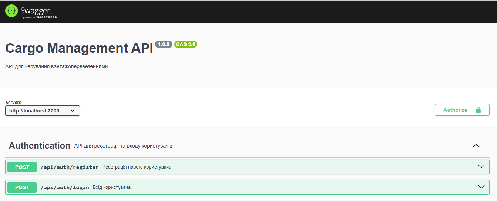
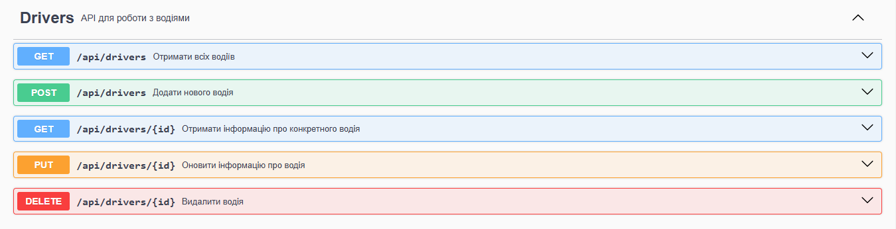
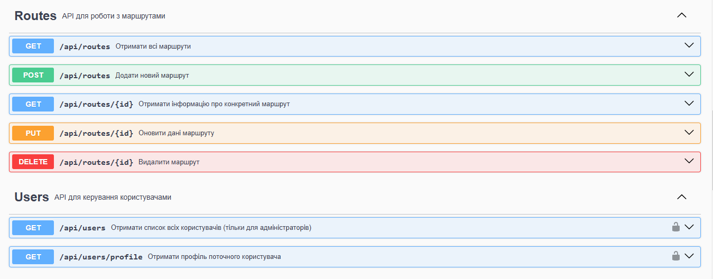
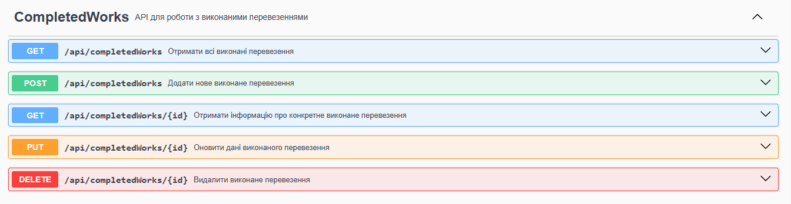
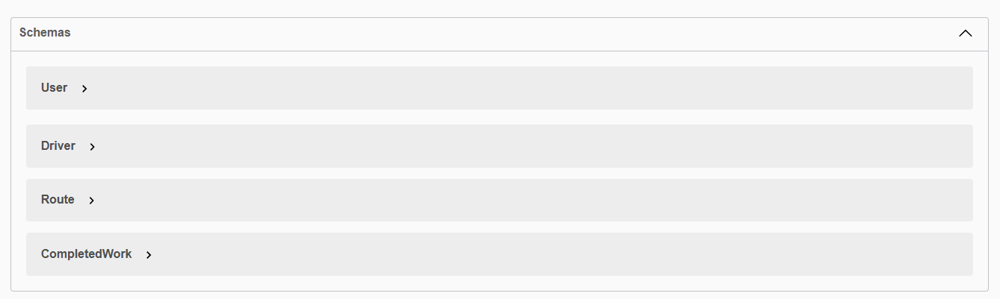

# Cargo Management API

Cargo Management API is an API for managing cargo transportation, built using Node.js, Express.js, and MongoDB. It provides authentication, user management, and CRUD operations for managing routes, drivers, and completed transportations.

## Table of Contents

- [Features](#features)
- [Instruction](#instruction)
- [API Documentation](#api-documentation)
- [Demo](#demo)
- [Endpoints](#endpoints)
- [Technologies Used](#technologies-used)
- [Contributing](#contributing)
- [License](#license)

## Features

- **Authentication & Authorization**: Implemented login and registration functionality.
- **CRUD Operations**: Basic create, read, update, and delete functionality for data.
- **Driver Management**: Add, update, delete, and retrieve drivers.
- **Route Management**: Manage available routes for cargo transportation.
- **Completed Work Management**: Track completed transportation jobs.
- **API Documentation**: Swagger documentation available.

### Instruction

1. Clone this repository:
   ```bash
   git clone https://github.com/sh-sofi/cargo-management-backend.git
   cd cargo-management-backend
   ```
2. Install dependencies:

   ```bash
   npm install
   ```

3. Create a `configuration.js` file in the config directory with the following variables:

- `PORT`: Specify the port for the local server.
- `JWT_SECRET`: Your secret key for generating JSON Web Tokens (JWT).
- `MONGO_URI`: Your connection to MongoDB.

4. Start the application:

   ```bash
   npm run start
   ```

5. Open Postman for testing the API or go to localhost:3000/api/docs to see Swagger API documentation.

## API Documentation

Swagger documentation is available at:
http://localhost:3000/api/docs

## Demo







## Endpoints

Here is a list of available endpoints in the project:

| **Method** | **Path**             | **Request JSON**                                                                                                                                  | **Response JSON**                                                           | **Response Status**           | **Description**                   |
| ---------- | -------------------- | ------------------------------------------------------------------------------------------------------------------------------------------------- | --------------------------------------------------------------------------- | ----------------------------- | --------------------------------- |
| POST       | /auth/register       | `{ "username": String, "email": String, "password": String }`                                                                                     | Success message and user object or error message                            | 201 Created / 400 Bad Request | Register a new user               |
| POST       | /auth/login          | `{ "email": String, "password": String }`                                                                                                         | Token, user object, or error message                                        | 200 OK / 400 Bad Request      | Log in a user                     |
| GET        | /users               | none                                                                                                                                              | Array of user objects without passwords                                     | 200 OK                        | Fetch all users                   |
| GET        | /users/profile       | none                                                                                                                                              | User profile object without password                                        | 200 OK                        | Fetch authenticated user profile  |
| GET        | /drivers             | none                                                                                                                                              | Array of driver objects                                                     | 200 OK                        | Fetch all drivers                 |
| GET        | /drivers/:id         | none                                                                                                                                              | Driver object or error message                                              | 200 OK / 404 Not Found        | Fetch a driver by ID              |
| POST       | /drivers             | `{ "lastName": String, "firstName": String, "middleName": String, "experience": Number }`                                                         | Created driver object or error message                                      | 201 Created / 400 Bad Request | Create a new driver               |
| PUT        | /drivers/:id         | `{ "lastName": String, "firstName": String, "middleName": String, "experience": Number }`                                                         | Updated driver object or error message                                      | 200 OK / 404 Not Found        | Update an existing driver         |
| DELETE     | /drivers/:id         | none                                                                                                                                              | Success message or error message                                            | 200 OK / 404 Not Found        | Delete a driver by ID             |
| GET        | /routes              | none                                                                                                                                              | Array of route objects                                                      | 200 OK                        | Fetch all routes                  |
| GET        | /routes/:id          | none                                                                                                                                              | Route object or error message                                               | 200 OK / 404 Not Found        | Fetch a route by ID               |
| POST       | /routes              | `{ "name": String, "distance": Number, "daysOnRoad": Number, "payment": Number }`                                                                 | Created route object or error message                                       | 201 Created / 400 Bad Request | Create a new route                |
| PUT        | /routes/:id          | `{ "name": String, "distance": Number, "daysOnRoad": Number, "payment": Number }`                                                                 | Updated route object or error message                                       | 200 OK / 404 Not Found        | Update an existing route          |
| DELETE     | /routes/:id          | none                                                                                                                                              | Success message or error message                                            | 200 OK / 404 Not Found        | Delete a route by ID              |
| GET        | /completed-works     | none                                                                                                                                              | Array of completed work objects with populated `route` and `drivers`        | 200 OK                        | Fetch all completed works         |
| GET        | /completed-works/:id | none                                                                                                                                              | Completed work object with populated `route` and `drivers` or error message | 200 OK / 404 Not Found        | Fetch a completed work by ID      |
| POST       | /completed-works     | `{ "route": String, "drivers": [String], "departureDate": String, "returnDate": String, "paymentBonus": Number (optional), "finalSums": Number }` | Created completed work object or error message                              | 201 Created / 400 Bad Request | Create a new completed work       |
| PUT        | /completed-works/:id | `{ "route": String, "drivers": [String], "departureDate": String, "returnDate": String, "paymentBonus": Number, "finalSums": Number }`            | Updated completed work object or error message                              | 200 OK / 404 Not Found        | Update an existing completed work |
| DELETE     | /completed-works/:id | none                                                                                                                                              | Success message or error message                                            | 200 OK / 404 Not Found        | Delete a completed work by ID     |

## Technologies Used

- **Node.js**: JavaScript runtime for server-side development.
- **Express.js**: Web framework for building RESTful APIs.
- **JWT (JSON Web Token)**: Used for secure user authentication.
- **bcryptjs**: For password hashing.
- **CORS**: Middleware for enabling secure cross-origin requests.
- **MongoDB (Mongoose)**: NoSQL database for storing and managing transportation data.
- **Swagger UI**: Tool for API documentation and testing.

## Contributing

This is a learning project, so contributions are not expected. However, feel free to fork and experiment with it. For suggestions or feedback, please open an issue.

## License

This project is licensed under the MIT License. See the LICENSE file for details.

##

Repository created during the course by TechMagic Academy "JavaScript Course".

Special thanks to the course instructor for guidance and learning materials. 🙌
